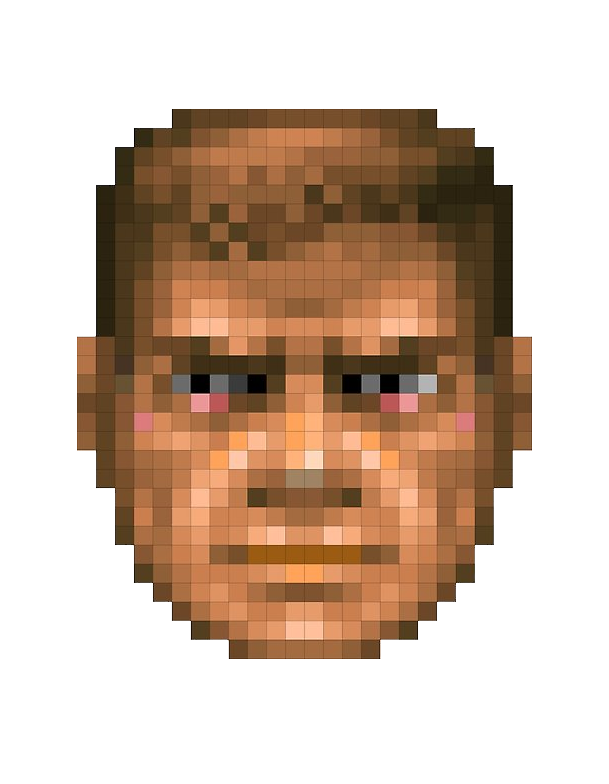

# Cursor Game: 2D Maze Shooter

A Python/Pygame maze shooter where you navigate mazes, collect ammo, and battle enemies. Features increasing difficulty, sprite-based animation, and a variety of power-ups.

## Features

- Procedurally generated mazes with guaranteed reachability for player, exit, and enemies
- WASD movement and smooth controls
- Sprite-based player, enemies, and bullets
- Ammo system (max 3 regular, pickups in maze)
- Super ammo (infinite, shoots through walls/enemies, activated with 'z')
- Animated player (mouth opens when shooting)
- Enemies with improved visuals and simple AI
- "Try Again" button on game over
- Increasing difficulty with each level

## Main Player Character



## Screenshots

*(Add screenshots here if you have them!)*

## How to Play

- **Move:** WASD
- **Shoot:** Spacebar (regular ammo)
- **Super Ammo:** Press 'z' (if collected)
- **Objective:** Reach the exit while avoiding or defeating enemies. Collect ammo and super ammo to survive!

## Installation

1. **Clone the repository:**
   ```bash
   git clone https://github.com/yourusername/cursor_game.git
   cd cursor_game
   ```

2. **(Optional) Create a virtual environment:**
   ```bash
   python3 -m venv venv
   source venv/bin/activate
   ```

3. **Install dependencies:**
   ```bash
   pip install pygame
   ```

4. **Run the game:**
   ```bash
   python3 main.py
   ```

## Sprites

All sprites are located in the `sprites/` folder. Player, enemy, and bullet sprites are custom-made or code-generated.

## Development Notes

- The code is organized for clarity and extensibility.
- Maze generation ensures all key elements are reachable and not overlapping.
- Contributions and suggestions are welcome!

## License

MIT License (or specify your own)

## Credits

- Game design and code: [Your Name]
- Sprites: [Your Name or sources]
- Built with [Pygame](https://www.pygame.org/)

---

*Happy maze running!*
